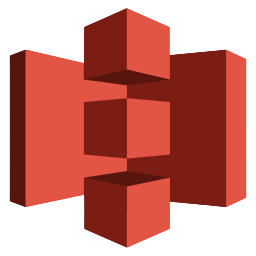

# language-aws-s3 

An OpenFn **_adaptor_** for building integration jobs for use with the
aws-s3 API.

## Documentation

View the
[docs site](https://docs.openfn.org/adaptors/packages/aws-s3-docs) for
full technical documentation.

## Usage

Import the adaptor and call its operations inside an OpenFn job. Minimal
API: prefer `get`, `put`, and `list` for most workflows. Backwards-compatible
aliases are provided (`upload`, `download`, `remove`) but keep your jobs
simple and use the minimal names when possible.

Put (upload) a file (sends raw `Body` to S3):

```javascript
put({ Bucket: 'my-bucket', Key: 'path/file.txt', Body: state.data.blob, ContentType: 'application/octet-stream' })
```

Get / Download a file (returns parsed JSON when available, otherwise base64 in `state.data`):

```javascript
get({ Bucket: 'my-bucket', Key: 'path/file.txt' })
```

List objects:

```javascript
list({ Bucket: 'my-bucket', Prefix: 'path/' })
```

Delete an object (alias `remove` retained for compatibility):

```javascript
remove({ Bucket: 'my-bucket', Key: 'path/file.txt' })
```

## Notes

- Authentication: the adaptor uses AWS SDK v3 `S3Client`. It will use the
	default credential provider chain unless `accessKeyId` and
	`secretAccessKey` are provided in `state.configuration`.
- `download` normalizes returned object bodies to base64 under
	`state.data.base64` (and includes `contentType` and `contentLength`).

## Scope

This adaptor focuses on simple object-level operations and intentionally
limits functionality in the initial release to keep the surface area small
and easy to maintain.

In scope:
- `upload` — put an object into a bucket
- `download` / `get` — retrieve an object; parsed as JSON when possible
- `list` / `search` — list objects and optionally fetch each object's contents
- `remove` — delete an object

Out of scope for this initial version:
- Multipart uploads
- Presigned URLs
- Bucket policy or ACL management
- Streaming very large objects (the adaptor reads objects into memory for
  parsing/base64 normalization)

These features may be added incrementally in future releases as needed.

## Credentials & Test Environments

- Demo / sandbox: For development and CI you can run a local S3-compatible
	sandbox such as LocalStack or MinIO. These provide isolated test
	environments without touching production AWS accounts.

- LocalStack quickstart (recommended for CI/dev):

	```bash
	# start LocalStack (requires Docker)
	localstack start -d

	# create a bucket for tests
	aws --endpoint-url=http://localhost:4566 s3api create-bucket --bucket openfn-test
	```

- MinIO quickstart (alternate):

	```bash
	docker run -p 9000:9000 -p 9001:9001 --name minio -e MINIO_ROOT_USER=access -e MINIO_ROOT_PASSWORD=secret -d minio/minio server /data --console-address ":9001"
	```

Note: Do NOT commit real AWS credentials into source control. Use
environment variables, CI secrets, or the default credential provider chain.

### Test Records

- With LocalStack or MinIO you can seed test objects using the AWS CLI pointing
	at the local endpoint. Example: upload a sample JSON object used by tests.

	```bash
	aws --endpoint-url=http://localhost:4566 s3 cp sample-data/patient.json s3://openfn-test/patients/1.json
	```

- The adaptor's unit tests are designed to run without network calls and use
	`aws-sdk-client-mock` so CI does not need a live S3 service.

## Authentication Methods

- AWS Signature v4 (recommended): the adaptor uses the AWS SDK v3 `S3Client`,
	which supports the standard credential provider chain (environment
	variables, shared credentials file, EC2/ECS/IRSA roles, etc.).
- Static credentials: you may supply `accessKeyId`, `secretAccessKey`,
	optional `sessionToken`, and `region` in `state.configuration` if you need
	to override the default provider for a job:

```javascript
state.configuration = {
	accessKeyId: process.env.AWS_ACCESS_KEY_ID,
	secretAccessKey: process.env.AWS_SECRET_ACCESS_KEY,
	region: 'us-east-1',
};
```

- Local endpoints: when testing against LocalStack/MinIO, pass the
	`endpoint` property via the SDK config (see AWS SDK docs) or configure the
	AWS CLI to use the local endpoint.

## Example Job Snippets

- Upload a file:

```javascript
upload({ Bucket: 'openfn-test', Key: 'patients/1.json', Body: state.data, ContentType: 'application/json' })
```

- Download and parse JSON (returns parsed JSON in `state.data` when JSON):

```javascript
download({ Bucket: 'openfn-test', Key: 'patients/1.json' })
// or use the `get` alias which parses JSON when available
get({ Bucket: 'openfn-test', Key: 'patients/1.json' })
```

- Search (list objects) and optionally fetch each result:

```javascript
// just list
list({ Bucket: 'openfn-test', Prefix: 'patients/' })

// list and fetch parsed objects
search({ Bucket: 'openfn-test', Prefix: 'patients/', fetch: true })
```

## Resources

- AWS S3 docs: https://docs.aws.amazon.com/s3/
- AWS SDK for JavaScript (v3) S3 client: https://docs.aws.amazon.com/AWSJavaScriptSDK/v3/latest/clients/client-s3/index.html
- LocalStack: https://localstack.cloud/
- MinIO: https://min.io/
- `aws-sdk-client-mock` (used in tests): https://github.com/m-radzikowski/aws-sdk-client-mock

## Logo

- The adaptor's logo assets live in the package `assets/` directory. Use
	`assets/square.png` for a square logo and add other sizes as needed.


### Configuration

View the
[configuration-schema](https://docs.openfn.org/adaptors/packages/aws-s3-configuration-schema/)
for required and optional `configuration` properties.

## Development

Clone the [adaptors monorepo](https://github.com/OpenFn/adaptors). Follow the
"Getting Started" guide inside to get set up.

Run tests using `pnpm run test` or `pnpm run test:watch`

Build the project using `pnpm build`.

To build _only_ the docs run `pnpm build docs`.
