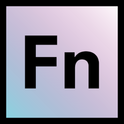

# language-azureblobstorage 

An OpenFn **_adaptor_** for building integration jobs for use with the Azure
Blob Storage API.

## Documentation

View the [docs site](https://docs.openfn.org/adaptors/packages/azureblobstorage-docs)
for full technical documentation.

### Configuration

View the
[configuration-schema](https://docs.openfn.org/adaptors/packages/azureblobstorage-configuration-schema/)
for required and optional `configuration` properties.

### An example showing multiple capabilties of this adaptor

Assume you have a simple `state.json` file as follows:

```json
{
  "data": {
	"foo": "bar",
	"bif": "baz",
	"sunday": "monday",
	"answer": "42"
  },
  "configuration": {
      "accountName": "myaccountname",
      "accountKey": "myaccountkey"
  }
}
```

Create a file `job.js`, as shown below, to run with the OpenFn CLI.

```js
const data = state.data;
const container = "mycontainer";
const src = "com.example";
const id = "0e82962a-6ed0-4a88-92c1-51ae785b4126";
const year = "2023";
const month = "11";

// Generate a full name for the blob based on a date-based partitioning
// scheme, as might be common in populating a data lake.
const blobBaseName = `${id}.json`;
const blobFullName = `${year}/${month}/${src}/${blobBaseName}`;
const content =  JSON.stringify(data);

// You can attach metadata as K/V pairs to objects that you upload.
// The keys and values must be strings.
let metadata = data;

// Set the content type and attach metadata
let uploadOptions = {
    blobHTTPHeaders: {blobContentType: 'application/json'},
    metadata: metadata
};

// Do all the things
execute(
  createContainer(container),
  uploadBlob(container, blobFullName, content, uploadOptions),
  checkBlobExists(container, blobFullName),
  downloadBlobAsJSON(container, blobFullName),
  downloadBlobAsString(container, blobFullName),
  getBlobProperties(container, blobFullName)
);
```

Run the job as follows:

```bash
openfn job -a azureblobstorage -s state.json -O
```

## Development

Clone the [adaptors monorepo](https://github.com/OpenFn/adaptors). Follow the
"Getting Started" guide inside to get set up.

Run tests using `pnpm run test` or `pnpm run test:watch`

Build the project using `pnpm build`.

To build _only_ the docs run `pnpm build docs`.
