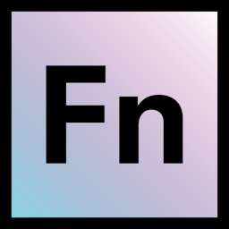

# language-collections 

An OpenFn **_adaptor_** for building integration jobs for use with the
collections API.

The collections API is not designed to be used alone, but in conjunction with
other adaptors.

## Documentation

View the [docs site](https://docs.openfn.org/adaptors/packages/collections-docs)
for full technical documentation.

## Development

Clone the [adaptors monorepo](https://github.com/OpenFn/adaptors). Follow the
"Getting Started" guide inside to get set up.

Run tests using `pnpm run test` or `pnpm run test:watch`

Build the project using `pnpm build`.

To build _only_ the docs run `pnpm build docs`.
